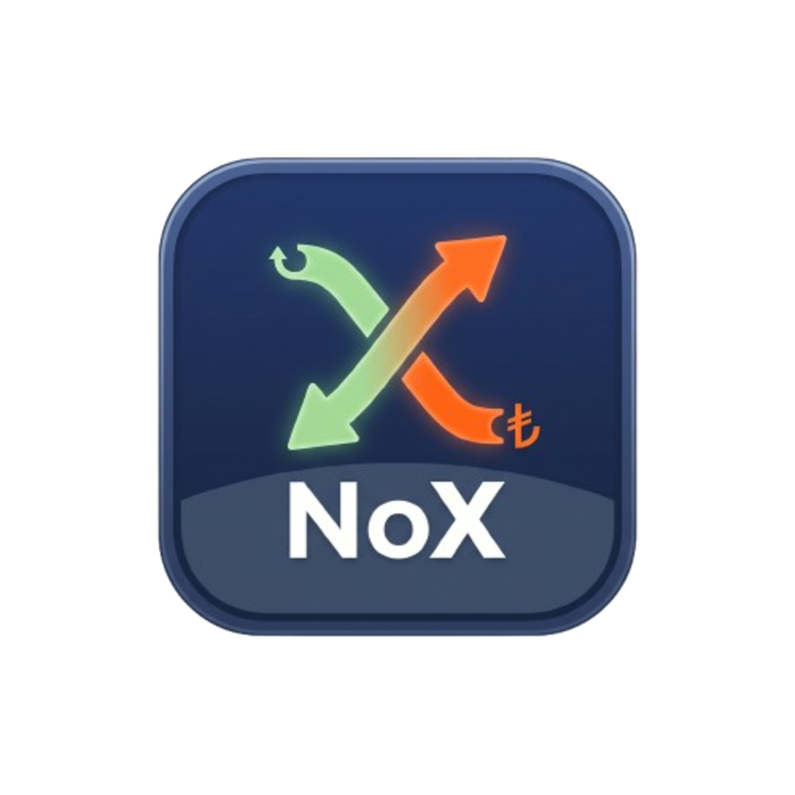
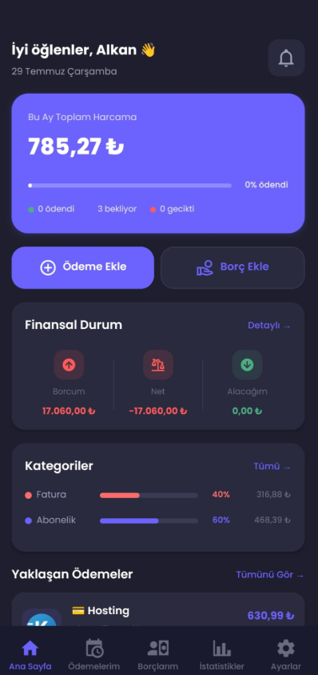
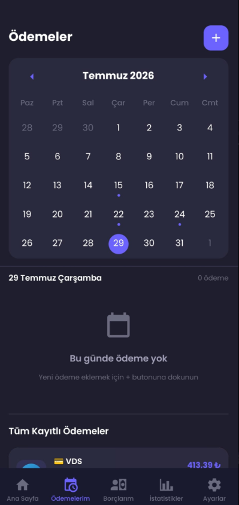
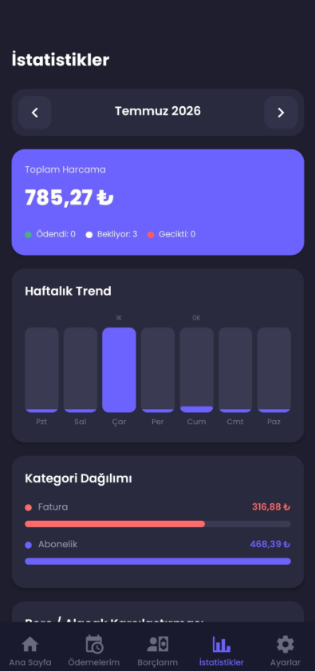
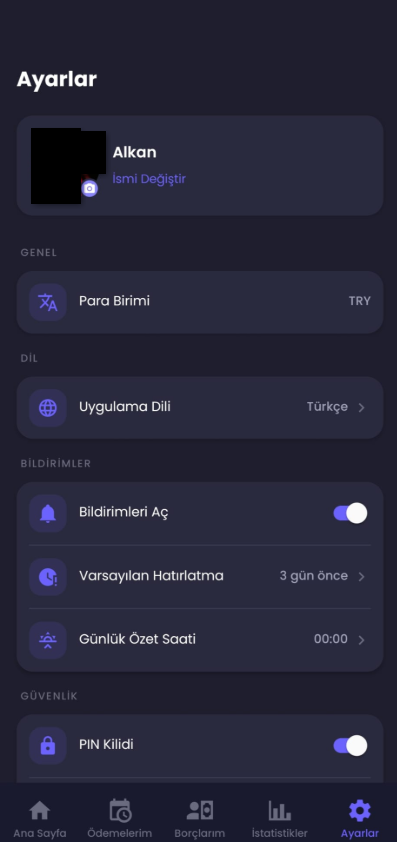
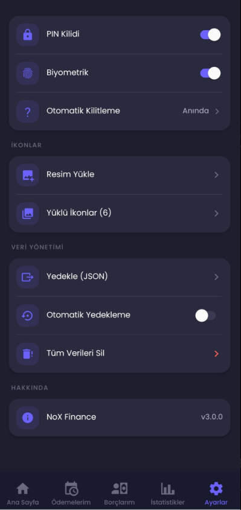

<div align="center">
  

  <h1>NoX Finance</h1>

  <p>
    Track your payments, debts, and receivables in one place.<br />
    A modern, device-first personal finance app built with privacy in mind.
  </p>

  <p>
    
    
    
    
  </p>
</div>

## Overview

NoX Finance is an Expo application for tracking one-time or recurring payments, personal debts, and receivables. Data is stored locally in an on-device SQLite database by default, so the app does not require an account or a remote server.

## Features

- One-time, weekly, monthly, and yearly payment tracking
- Categories, due dates, times, notes, currencies, and custom icons
- Separate states for pending, paid, and overdue payments
- Debt and receivable tracking with partial payments and payment history
- Due dates, interest rates, and multiple reminders for debts
- Monthly spending summaries, weekly trends, and category breakdowns
- Support for TRY, USD, EUR, and GBP
- Multiple local reminder times for payments, debts, and receivables
- Detailed in-app notification center with deep links to each record
- PIN protection, biometric authentication, and automatic locking
- Automatic rotating local backups, JSON export, folder restore, and cloud-provider sharing
- Secure in-app deletion of all application data

## Screenshots

<table>
  <tr>
    <td align="center"></td>
    <td align="center"></td>
    <td align="center"></td>
  </tr>
  <tr>
    <td align="center"><sub><b>Dashboard</b></sub></td>
    <td align="center"><sub><b>Payments</b></sub></td>
    <td align="center"><sub><b>Statistics</b></sub></td>
  </tr>
  <tr>
    <td align="center"></td>
    <td align="center"></td>
    <td align="center">
      <b>Privacy focused</b><br /><br />
      <sub>Local database<br />SecureStore PIN protection<br />Biometric lock<br />Privacy-aware notifications</sub>
    </td>
  </tr>
  <tr>
    <td align="center"><sub><b>Settings</b></sub></td>
    <td align="center"><sub><b>Security and data management</b></sub></td>
    <td></td>
  </tr>
</table>

## Security and privacy

- The PIN is stored in the operating system's secure key store instead of SQLite.
- A plaintext PIN left by an older version is migrated to secure storage and removed from the database.
- Notifications do not expose names, payment labels, or amounts.
- Notification permission is requested only after the user enables the feature.
- Android notification channels use secret lock-screen visibility.
- JSON exports exclude the PIN, biometric settings, and local profile image path.
- Export files are created in temporary cache storage and removed after sharing.
- Environment files, databases, backups, signing keys, and build artifacts are excluded from Git.

> [!WARNING]
> JSON backups may contain personal financial information, including payments, debts, and profile details. Store exported files only in a location you trust.

## Tech stack

| Area | Technology |
| --- | --- |
| Application framework | Expo SDK 57, React Native 0.86, React 19 |
| Navigation | Expo Router |
| Language | TypeScript |
| Local data | Expo SQLite |
| Secure storage | Expo SecureStore |
| Authentication | Expo Local Authentication |
| Notifications | Expo Notifications |
| Animations | React Native Reanimated |
| Calendar | React Native Calendars |

## Getting started

### Requirements

- Node.js 22.13 or newer
- npm
- Expo Go, an Android emulator, or the iOS Simulator

Clone the repository and install the dependencies:

```bash
git clone https://github.com/Payroniz/nox-finance-app.git
cd nox-finance-app
npm install
```

Start the development server:

```bash
npm start
```

Run a specific platform:

```bash
npm run android
npm run ios
npm run web
```

> Running the iOS Simulator or creating a local iOS build requires macOS.

## Building an Android APK

The project includes `development`, `preview`, and `production` EAS Build profiles. To create a preview APK:

```bash
npm install --global eas-cli
eas login
npm run build:android
```

## Web deployment note

Expo SQLite uses WASM and `SharedArrayBuffer` on the web. The required Metro configuration is already included. When deploying anywhere other than EAS Hosting, make sure your server also returns these HTTP headers:

```text
Cross-Origin-Embedder-Policy: credentialless
Cross-Origin-Opener-Policy: same-origin
```

## Project structure

```text
.
├── app/                    # Expo Router screens and routes
│   ├── (tabs)/             # Main tab screens
│   ├── debt/               # Debt creation and detail screens
│   └── payment/            # Payment creation and detail screens
├── assets/                 # App icons and splash assets
├── docs/screenshots/       # Screenshots used in this README
├── src/
│   ├── components/         # Reusable UI components
│   ├── constants/          # Theme values and TypeScript types
│   ├── db/                 # SQLite schema and data operations
│   └── utils/              # Notifications, security, and helpers
├── app.json                # Expo application configuration
├── eas.json                # EAS Build profiles
└── metro.config.js         # Metro and SQLite WASM configuration
```

## Validation

Run these checks before submitting changes:

```bash
npx tsc --noEmit
npx expo-doctor
npx expo export --platform android
```

## Contributing

Contributions are welcome:

1. Fork the repository.
2. Create a feature branch: `git switch -c feature/my-feature`
3. Implement and validate your changes.
4. Create a descriptive commit and open a pull request.

<div align="center">
  <sub>Simplify your financial tracking with NoX Finance.</sub>
</div>
